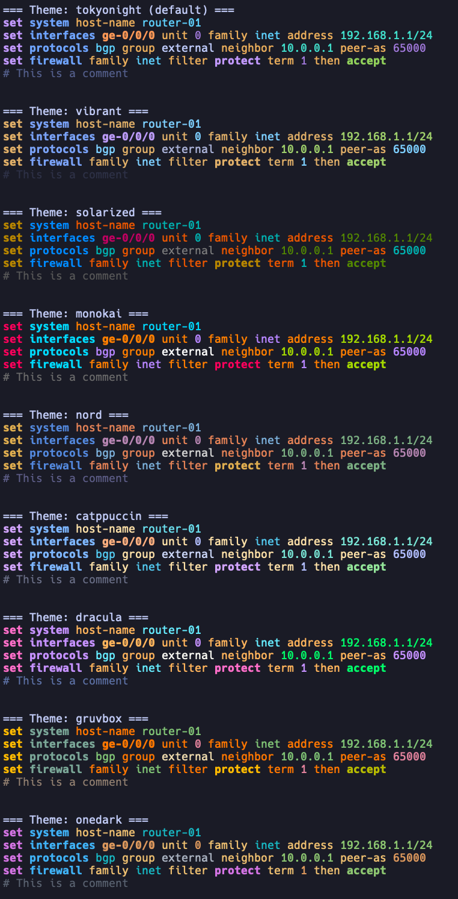

# jink

**Ink your JunOS config.** Terminal syntax highlighter for JunOS (Juniper Networks) configuration with real-time SSH session highlighting and pipe support.


## Features

- Real-time syntax highlighting for SSH sessions
- Pipe configuration files for highlighted output
- Multiple color themes (Tokyo Night, Monokai, Nord, Solarized, etc.)
- Auto-detection of JunOS content with force mode override
- Recognizes JunOS-specific syntax:
  - Commands (`set`, `delete`, `show`, `commit`, etc.)
  - Sections (`system`, `interfaces`, `protocols`, etc.)
  - Protocols (`ospf`, `bgp`, `mpls`, `tcp`, etc.)
  - Interfaces (`ge-0/0/0`, `ae0`, `lo0`, `irb.100`, etc.)
  - IP addresses (IPv4, IPv6, prefixes)
  - Firewall actions (`accept`, `reject`, `discard`)
  - Comments and annotations




## Installation

### From Source

```bash
git clone https://github.com/lasseh/jink.git
cd jink
make build
make install  # Installs to $GOPATH/bin or ~/go/bin
```

### Go Install

```bash
go install github.com/lasseh/jink/cmd/jink@latest
```

## Usage

### SSH Sessions

Wrap your SSH command with `jink` for real-time highlighting:

```bash
jink ssh admin@192.168.1.1
jink ssh -p 2222 admin@router.example.com
```

### Pipe Configuration Files

```bash
cat router-config.conf | jink
jink < backup-config.txt
```

### Select a Theme

```bash
jink -t monokai ssh admin@router
jink -t nord < config.conf
cat config.conf | jink -t solarized
```

### Force Highlighting

Skip auto-detection and always highlight (useful when detection fails):

```bash
cat config.conf | jink -f
ssh router "show configuration" | jink --force
```

## Themes

| Theme | Description |
|-------|-------------|
| `tokyonight` | Tokyo Night - soft, modern colors (default) |
| `vibrant` | Bright, high-contrast colors |
| `solarized` | Solarized Dark color scheme |
| `monokai` | Monokai-inspired colors |
| `nord` | Nord color palette |
| `catppuccin` | Catppuccin Mocha - pastel colors |
| `dracula` | Dracula - popular dark theme |
| `gruvbox` | Gruvbox Dark - retro groove |
| `onedark` | Atom One Dark |

Preview all themes:

```bash
make demo-all
```

## Shell Aliases

Create an alias to use `jink` as a drop-in replacement for `ssh`:

### Bash (~/.bashrc)

```bash
alias ssh='jink ssh'
alias jssh='jink ssh'
```

### Zsh (~/.zshrc)

```zsh
alias ssh='jink ssh'
alias jssh='jink ssh'
```

### Fish (~/.config/fish/config.fish)

```fish
alias ssh 'jink ssh'
alias jssh 'jink ssh'
```

After adding the alias, reload your shell or run `source ~/.bashrc` (or equivalent).

Now you can use `ssh` or `jssh` with automatic highlighting:

```bash
ssh admin@router           # Uses jink automatically
jssh admin@router          # Dedicated alias for JunOS highlighting
ssh -p 2222 admin@router   # All SSH arguments work normally
```

## Examples

### Basic SSH Session

```bash
$ jink ssh admin@core-router
admin@core-router> show configuration interfaces
```

### View Configuration with Highlighting

```bash
# From a file
cat /var/log/junos-backup.conf | jink

# From clipboard (macOS)
pbpaste | jink

# From clipboard (Linux)
xclip -o | jink
```

### Compare Themes

```bash
# Show sample config in each theme
make demo        # Default theme (Tokyo Night)
make demo-set    # Set-style configuration
make demo-all    # All themes side by side
```

## Building

```bash
make build       # Build binaries to build/
make install     # Install to Go bin directory
make test        # Run tests
make clean       # Clean build artifacts
```

## Command Line Reference

```
jink [OPTIONS] [command] [args...]

OPTIONS:
    -f, --force           Always highlight (skip auto-detection)
    -t, --theme <name>    Color theme (see Themes section)
    -n, --no-highlight    Disable highlighting (pass-through mode)
    -v, --version         Show version
    -h, --help            Show help

EXAMPLES:
    jink ssh admin@192.168.1.1
    jink -t monokai ssh admin@router
    cat config.conf | jink
    cat config.conf | jink -f
    jink < config.conf
```

## Library Usage

Use `jink` as a Go library in your own projects:

```bash
go get github.com/lasseh/jink
```

### Simple Highlighting

```go
import "github.com/lasseh/jink/highlighter"

// One-liner with default theme
colored := highlighter.Highlight(config)
fmt.Println(colored)
```

### With Custom Theme

```go
import "github.com/lasseh/jink/highlighter"

// Use a specific theme
hl := highlighter.NewWithTheme(highlighter.MonokaiTheme())
colored := hl.Highlight(config)

// Or get theme by name
theme := highlighter.ThemeByName("nord")
hl := highlighter.NewWithTheme(theme)

// List available themes
themes := highlighter.ThemeNames() // ["tokyonight", "vibrant", "solarized", ...]
```

### Tokenization (for custom rendering)

```go
import "github.com/lasseh/jink/lexer"

lex := lexer.New(config)
tokens := lex.Tokenize()

for _, tok := range tokens {
    fmt.Printf("%s: %q\n", tok.Type, tok.Value)
    // Output: Command: "set"
    //         Section: "interfaces"
    //         Interface: "ge-0/0/0"
    //         IPv4Prefix: "192.168.1.0/24"
}
```

### Available Packages

| Package | Description |
|---------|-------------|
| `highlighter` | ANSI color highlighting with theme support |
| `lexer` | Tokenizer for JunOS config and show output |
| `terminal` | PTY wrapper for real-time highlighting (CLI-specific) |

## How It Works

1. **Lexer**: Tokenizes JunOS configuration text into meaningful tokens (commands, sections, IPs, interfaces, etc.)
2. **Highlighter**: Applies ANSI color codes based on token types and selected theme
3. **Terminal**: Wraps commands with a PTY for real-time output processing

The highlighter includes heuristics to detect JunOS configuration and avoid highlighting unrelated text.

## License

MIT
